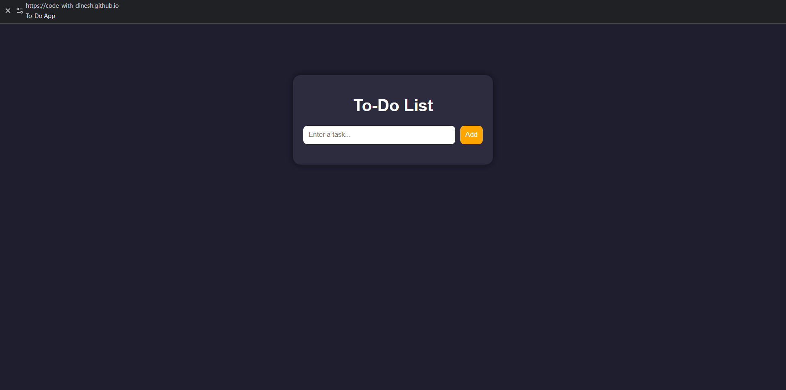

# 📝 To-Do App

A simple and modern To-Do List application built using HTML, CSS, and JavaScript.

## 🚀 Features

- Add tasks
- Delete tasks
- Mark tasks as completed
- Data stored using Local Storage

## 🛠️ Tech Used

- HTML
- CSS
- JavaScript

## 📸 Preview

## 🌐 Live Demo
 https://code-with-dinesh.github.io/day-1-modern-calculator/
